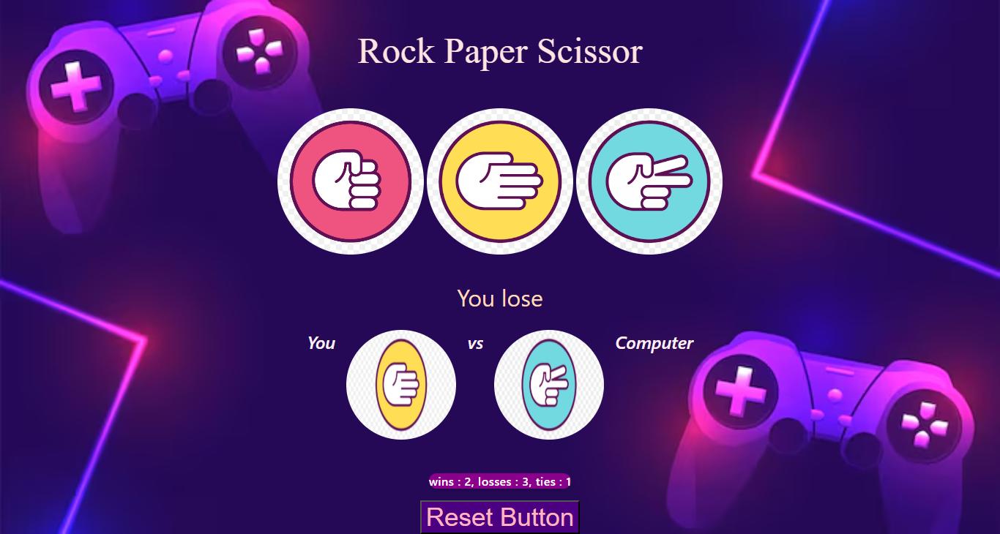

# 🪨📰✂️ Rock, Paper, Scissors Game

An interactive web-based Rock, Paper, Scissors game featuring an engaging neon gaming UI, dynamic score tracking, and instant win/loss feedback.

## 🚀 Live Demo
[👉 Click here to play the game live!](https://priya-bhagat01.github.io/my_RPS_project/)

## 📸 Game Preview

## 🛠️ Features & Core Logic
- **Vanilla JavaScript Logic:** Processes game choices, evaluates conditions, and determines the winner dynamically.
- **State Management:** Tracks global stats for `wins`, `losses`, and `ties` across multiple rounds.
- **Interactive UI:** Utilizes event listeners to capture player choices and instantly manipulate the DOM to display computer selections and results.

## 🧰 Tech Stack
- HTML5
- CSS
- JavaScript
